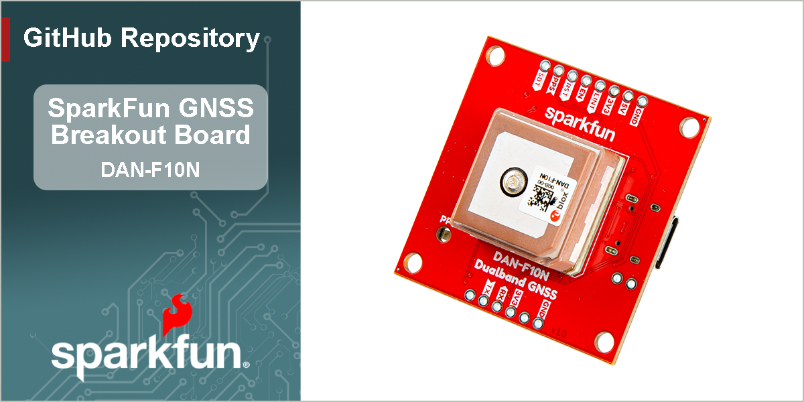

SparkFun Dualband L1/L5 GNSS Breakout - DAN-F10N
========================================

[*SparkFun Dualband L1/L5 GNSS Breakout - DAN-F10N (GPS-28435)*](https://www.sparkfun.com/sparkfun-dualband-l1-l5-gnss-breakout-dan-f10n.html)

The SparkFun DAN-F10N Dualband GNSS Breakout is built around the powerful u-blox F10 engine, offering simultaneous reception of L1 and L5 frequency bands. This board leverages u-blox's advanced multipath mitigation technology to isolate the strongest signals, delivering reliable, meter-level position accuracy even in dense urban canyons. To ensure signal integrity, the module incorporates a robust SAW-LNA-SAW RF front-end with an additional notch filter (LTE B13), providing excellent rejection of interference from nearby cellular modems.

The SparkFun Dualband L1/L5 GNSS Breakout - DAN-F10N features u-blox's dual-band GNSS technology for the L1/L5 frequency bands. Their proprietary dual-band multipath mitigation technology enables the u-blox F10 GNSS engine to isolate the best signals from the L1 and L5 bands; delivering a solid meter-level position accuracy in challenging urban environments. Additionally, the DAN-F10N module's robust SAW-LNA-SAW RF architecture with an additional notch filter (LTE B13) on the L1 RF path ensures the best possible out-of-band interference mitigation from nearby cellular modems.

The DAN-F10N GNSS module on this board comes with a 20 x 20 x 8 mm, integrated, Right Hand Circular Polarized (RHCP), L1/L5 dual-band patch antenna that offers the best compromise between size and performance. The patch antenna's wide beamwidth provides flexibility in the device's orientation; while alternatively, the module also has an antenna switch function to give users the option to utilize an external dual-band antenna, further increasing its utility.

The DAN-F10N module is supported by the u-blox u-center 2 GNSS software for real-time performance analysis, receiver configuration, and data logging. The AssistNow Online, Offline, and Autonomous A-GNSS services can also be used with the module for faster satellite acquisition. Users can also interface with the GNSS module using NMEA 4.11 and UBX binary protocols.

> [!NOTE]
> The GPS `L5` signals are currently, considered as *"pre-operational"* and not utilized by default in navigation solutions. However, it is possible override the receiver's configuration to evaluate the GPS `L5` signals. Please refer to the integration manual for more details.
> 
> This is an operational limitation of the satellite/space segment and not an issue of the u-blox product.

Documentation
-------------

- **[Hookup Guide (mkdocs)](http://docs.sparkfun.com/SparkFun_GNSS_DAN-F10N/)** - A hookup guide for the SparkFun DAN-F10N Dualband L1/L5 GNSS breakout board hosted by GitHub pages. 
   
- [SparkFun u-blox GNSS v3 Arduino Library](https://github.com/sparkfun/SparkFun_u-blox_GNSS_v3) - An Arduino library for the u-blox GNSS module

Repository Contents
-------------------

- **[/docs](/docs/)** - Online documentation files
  - [/assets](/docs/assets/) - Assets files
    - [/3d_model](/docs/assets/3d_model/) - 3D models for the board
    - [/board_files](/docs/assets/board_files/) - Design files for the board
      - [KiCad Design Files](/docs/assets/board_files/kicad_files.zip) (.zip)
      - [Schematic](/docs/assets/board_files/schematic.pdf) (.pdf)
      - [Dimensions](/docs/assets/board_files/dimensions.pdf) (.pdf)
    - [/component_documentation](/docs/assets/component_documentation/) - Datasheets for hardware components
    - [/img/hookup_guide](/docs/assets/img/hookup_guide/) - Images for hookup guide documentation - Hookup guide images for the board
    - /Hardware - Hardware design files (.brd, .sch)
      - /Production - Production files

Product Variants
----------------

- [GPS-28435](https://www.sparkfun.com/sparkfun-dualband-l1-l5-gnss-breakout-dan-f10n.html) - Breakout Board
- [GPS-29061](https://www.sparkfun.com/sparkpnt-gnss-flex-module-dan-f10n.html) - SparkPNT GNSS Flex Module
- [GPS-29491](https://www.sparkfun.com/sparkfun-gnss-flex-phat-dan-f10n.html) - SparkFun GNSS Flex pHAT *(kit)*

Version History
---------------

- [v10](https://github.com/sparkfun/SparkFun_GNSS_DAN-F10N/releases/tag/v10) - Initial Release

License Information
-------------------

This product is ***open source***!

Please review the [`LICENSE.md`](./LICENSE.md) file for license information.

If you have any questions or concerns about licensing, please contact technical support on our [SparkFun forums](https://forum.sparkfun.com/viewforum.php?f=152).

Distributed as-is; no warranty is given.

- Your friends at SparkFun.
