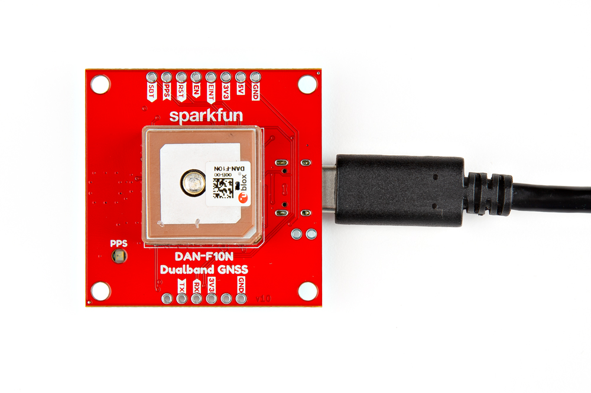
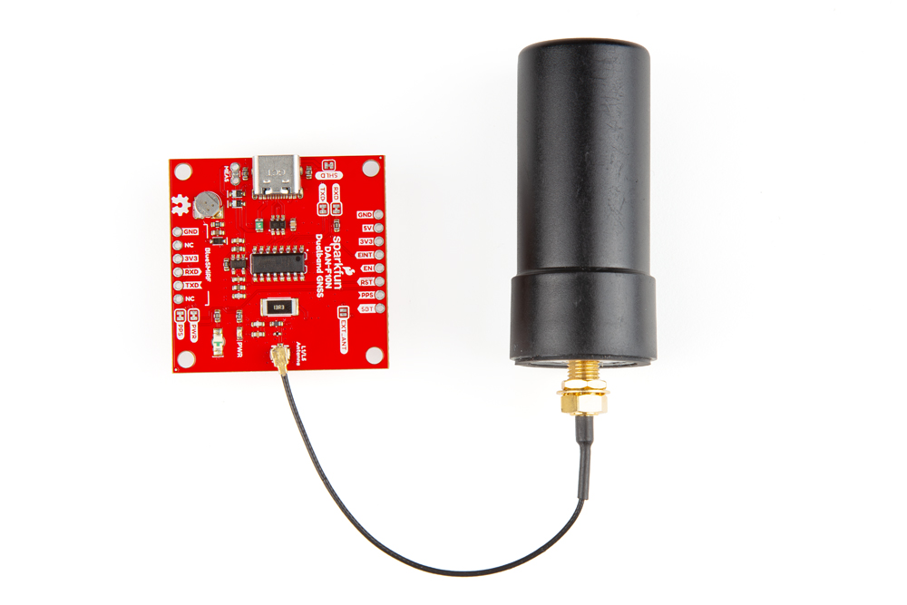
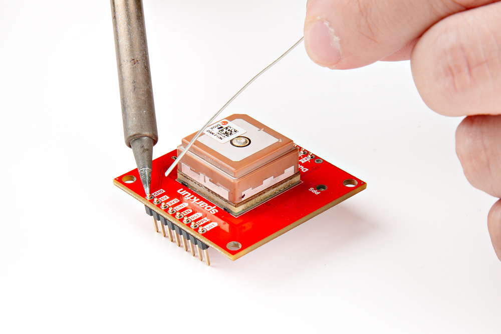
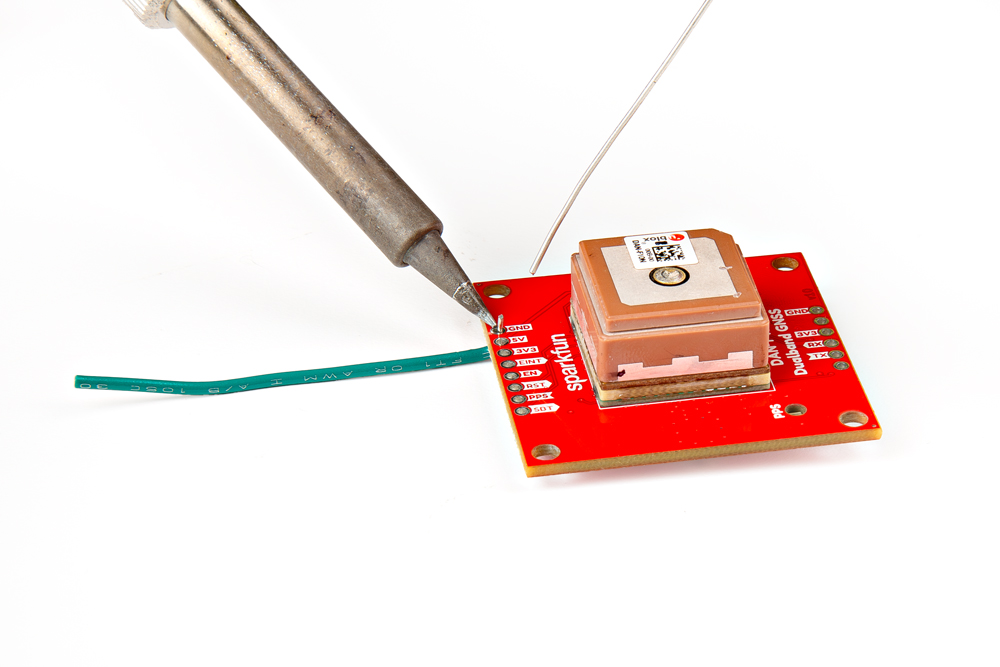
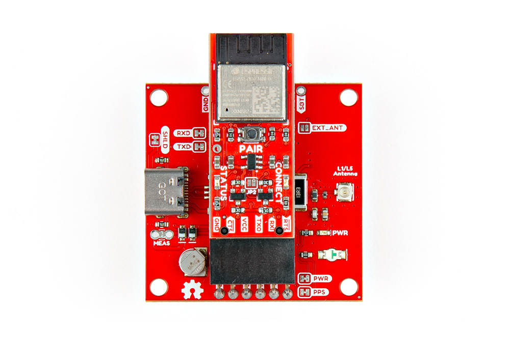

## USB Programming
The USB connection is utilized for configuration and serial communication. Users only need to connect their DAN-F10N Dualband L1/L5 GNSS breakout board to a computer using a USB-C cable.

<figure markdown>
[{ width="400" }](./assets/img/hookup_guide/assembly-usb.jpg "Click to enlarge")
<figcaption markdown>The DAN-F10N Dualband L1/L5 GNSS breakout board with a USB-C cable attached.</figcaption>
</figure>

!!! tip "USB Driver"
	Users will need to install a USB driver before they can interact with the GNSS module. For more details, please refer to the [**USB Driver** section of the Software page](software_overview.md/#usb-driver).

!!! info "Default Settings"
	- Baudrate: 38400bps
	- Data Bits: 8
	- Parity: No
	- Stop Bits: 1

## External Antenna

<figure markdown>
[{ width="400" }](./assets/img/hookup_guide/assembly-antenna.jpg "Click to enlarge")
<figcaption markdown>Soldering the `EXT_ANT` jumper on the DAN-F10N GNSS breakout board to utilize the GNSS antenna attached to the U.FL connector.</figcaption>
</figure>

In order to receive [GNSS](https://en.wikipedia.org/wiki/Satellite_navigation "Global Navigation Satellite System") signals, a compatible antenna is required. Users have the option of utilizing the integrated L1/L5 dual-band patch antenna or an external GNSS antenna. An external antenna can be connected to the U.FL connector on the board with an [U.FL to SMA adapter cable](https://www.sparkfun.com/sma-to-u-fl-cable-150mm.html). In order to trigger the RF switch inside the DAN-F10N GNSS module to utilize the U.FL connector as its signal source, the `EXT_ANT` jumper must be modified.

!!! tip
	For the best performance, we recommend users choose a compatible L1/L5 GNSS antenna and utilize a low-loss cable. Also, don't forget that GNSS signals are fairly weak and can't penetrate buildings or dense vegetation. The GNSS antenna should have an unobstructed view of the sky.

??? note "Never modified a jumper before?"
	Check out our <a href="https://learn.sparkfun.com/tutorials/664">Jumper Pads and PCB Traces tutorial</a> for a quick introduction!

	<article class="grid cards" markdown align="center">

	-   <a href="https://learn.sparkfun.com/tutorials/664">
		<figure markdown>
		
		</figure>

		---

		**How to Work with Jumper Pads and PCB Traces**</a>

	</article>

## Breakout Pins
The [PTH](https://en.wikipedia.org/wiki/Through-hole_technology "Plated Through Holes") pins on the DAN-F10N Dualband L1/L5 GNSS breakout board are broken out into 0.1"-spaced pins on the outer edges of the board.

??? note "New to soldering?"
	If you have never soldered before or need a quick refresher, check out our [How to Solder: Through-Hole Soldering](https://learn.sparkfun.com/tutorials/how-to-solder-through-hole-soldering) guide.

	

	-   <a href="https://learn.sparkfun.com/tutorials/5">
		<figure markdown>
		
		</figure>

		---

		**How to Solder: Through-Hole Soldering**</a>

	

**Headers**

---

When selecting headers, be sure you are aware of the functionality you require.

<figure markdown>
[{ width="400" }](./assets/img/hookup_guide/assembly-headers.jpg "Click to enlarge")
<figcaption markdown>Soldering headers to the DAN-F10N GNSS breakout board.</figcaption>
</figure>

**Hookup Wires**

---

For a more permanent connection, users can solder wires directly to the board.

<figure markdown>
[{ width="400" }](./assets/img/hookup_guide/assembly-wires.jpg "Click to enlarge")
<figcaption markdown>Soldering wires to the DAN-F10N GNSS breakout board.</figcaption>
</figure>

### BlueSMiRF Header Pins
One of the two sets of [PTH](https://en.wikipedia.org/wiki/Through-hole_technology "Plated Through Holes") pins on the DAN-F10N Dualband L1/L5 GNSS breakout board is labeled `BlueSMiRF`. This set of header pins breaks out the UART interface of the DAN-F10N module, which can be connected to a microcontroller or RF transceiver; such as the [BlueSMiRF *v2*](https://www.sparkfun.com/sparkfun-bluesmirf-v2-headers.html), Bluetooth^&reg;^ serial link. The BlueSMiRF *v2* comes in two variations, with [PTH pins](https://www.sparkfun.com/sparkfun-bluesmirf-v2.html) or [male header pins](https://www.sparkfun.com/sparkfun-bluesmirf-v2-headers.html). Users can directly solder the PTH variant to the board with [male headers](https://www.sparkfun.com/break-away-headers-straight.html), for a more permanent installation; otherwise, for more flexibility, a [stackable header](https://www.sparkfun.com/arduino-stackable-header-6-pin.html) can be utilized.

<figure markdown>
[{ width="400" }](./assets/img/hookup_guide/assembly-bluesmirf.jpg "Click to enlarge")
<figcaption markdown>Connecting the BlueSMiRF serial link to the BlueSMiRF header on the DAN-F10N GNSS breakout board.</figcaption>
</figure>

!!! info "Default Settings"
	- Baudrate: 38400bps
	- Data Bits: 8
	- Parity: No
	- Stop Bits: 1

!!! warning "Bus Contention"
	To avoid [bus contention](https://en.wikipedia.org/wiki/Bus_contention) issues with the USB-C connection, users may want to use the [`RXD` and `TXD` jumpers](hardware_overview.md#jumpers) to disconnect the CH340 USB-to-serial converter from the UART interface of the DAN-F10N GNSS module.

When connecting the DAN-F10N Dualband L1/L5 GNSS breakout board to another device, users need to be aware of the pin connections and voltage ranges of the products. Below, is a table of the pin connections that users can reference.

<article style="text-align: center;" markdown>

<table border="1" markdown>
<tr markdown>
<th style="vertical-align:middle;">Pin Number</th>
<td align="center" markdown>
	**1** 
	*(Left Side)*
</td>
<td align="center" markdown>**2**</td>
<td align="center" markdown>**3**</td>
<td align="center" markdown>**4**</td>
<td align="center" markdown>**5**</td>
<td align="center" markdown>
	**6** 
	*(Right)*
</td>
</tr>
<tr markdown>
<th style="vertical-align:middle;">Label</th>
<td align="center" markdown>`NC`</td>
<td align="center" markdown>`TXD`</td>
<td align="center" markdown>`RXD`</td>
<td align="center" markdown>`3V3`</td>
<td align="center" markdown>`NC`</td>
<td align="center" markdown>`GND`</td>
</tr>
<tr markdown>
<th style="vertical-align:middle;">Function</th>
<td align="center" markdown></td>
<td align="center" markdown>UART - Transmit</td>
<td align="center" markdown>UART - Receive</td>
<td align="center" markdown>Output Voltage: **3.3V**</td>
<td align="center" markdown></td>
<td align="center" markdown>Ground</td>
</tr>
</table>

</article>
