## :material-folder-cog: Design Files

<!-- Import the component -->

-   :kicad-primary:{ .enlarge-logo } Design Files

	---

	- :fontawesome-solid-file-pdf: [Schematic](./assets/board_files/schematic.pdf)
	- :material-folder-zip: [KiCad Files](./assets/board_files/kicad_files.zip)
	- :material-rotate-3d: [STEP File](./assets/3d_model/cad_model.step)
	- :fontawesome-solid-file-pdf: [Board Dimensions](./assets/board_files/dimensions.pdf):
		- 2.50" x 2.00" (635mm x 508mm)

-   <!-- Boxes in tabs -->

	=== "3D Model"
		<article style="text-align: center;" markdown>
		<model-viewer src="../assets/3d_model/web_model.glb" camera-controls poster="../assets/3d_model/poster.png" tone-mapping="neutral" shadow-intensity="2" shadow-softness="0.2" camera-orbit="0deg 75deg 0.103m" field-of-view="25.11deg" style="width: 100%; height: 450px;">
		</model-viewer>

		[Download the `*.step` File](./assets/3d_model/cad_model.step "Click download"){ .md-button .md-button--primary width="250px" }

		</article>

		???+ tip "Manipulate 3D Model"
			<article style="text-align: center;" markdown>

			| Controls       | Mouse                    | Touchscreen    |
			| :------------- | :----------------------: | :------------: |
			| Zoom           | Scroll Wheel             | 2-Finger Pinch |
			| Rotate         | ++"Left-Click"++ & Drag  | 1-Finger Drag  |
			| Move/Translate | ++"Right-Click"++ & Drag | 2-Finger Drag  |

			</article>

	=== "Dimensions"
		<article style="text-align: center;" markdown>
		[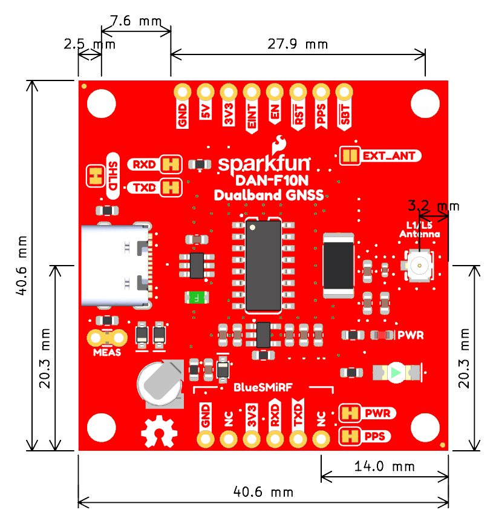{ width="450" }](./assets/board_files/dimensions.png "Click to enlarge")
		<figcaption markdown>Dimensions of the DAN-F10N GNSS breakout board.</figcaption>
		</article>

		???+ tip "Need more measurements?"
			For more information about the board's dimensions, users can download the [KiCad files](./assets/board_files/kicad_files.zip) for this board. These files can be opened in KiCad and additional measurements can be made with the measuring tool.

			!!! info ":octicons-download-16:{ .heart } KiCad - Free Download!"
				KiCad is free, open-source [CAD]("computer-aided design") program for electronics. Click on the button below to download their software. *(\*Users can find out more information about KiCad from their [website](https://www.kicad.org/).)*

				<article style="text-align: center;" markdown>
				[Download :kicad-primary:{ .enlarge-logo }](https://www.kicad.org/download/ "Go to downloads page"){ .md-button .md-button--primary width="250px" }
				</article>

			???+ info ":straight_ruler: Measuring Tool"
				This video demonstrates how to utilize the dimensions tool in KiCad, to include additional measurements:

				<article class="video-500px" style="text-align: center; margin: auto;" markdown>
				<iframe src="https://www.youtube.com/embed/-eXuD8pkCYw" title="KiCad Dimension Tool" frameborder="0" allow="accelerometer; autoplay; clipboard-write; encrypted-media; gyroscope; picture-in-picture" allowfullscreen></iframe>
				{ .qr width="85" }
				</article>

## Board Layout
The SparkFun Dualband L1/L5 GNSS Breakout - DAN-F10N features the following:

<figure markdown>
[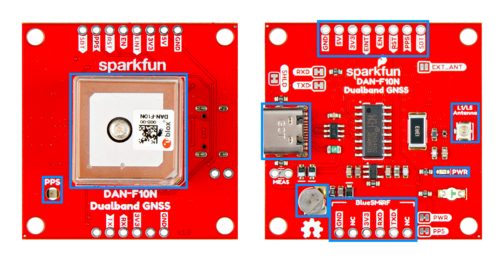{ width="750" }](./assets/img/hookup_guide/layout.png "Click to enlarge")
<figcaption markdown>Layout of the major components on the breakout board.</figcaption>
</figure>

1. **USB-C Connector**
:   The primary inteface for powering and interacting with the board
1. **DAN-F10N GNSS Module**
:   The u-blox DAN-F10N GNSS module
1. **Headers**
:   Exposes pins to power the board and breaks out the pins of the DAN-F10N GNSS module
1. **Status LEDs**
:   LED status indicators for the DAN-F10N GNSS module
1. **`L1/L5 Antenna` U.FL Connector**
:   An optional input for an external GNSS antenna
1. **Backup Battery**
:   Backup power to maintain ephemeris data on the DAN-F10N GNSS module for warm starts

## Power
The simplest method to power the board is through the USB-C connector. However, the DAN-F10N Dualband L1/L5 GNSS breakout board only requires **3.3V**, which can be supplied though the [PTH](https://en.wikipedia.org/wiki/Through-hole_technology "Plated Through Holes") pins.

<figure markdown>
[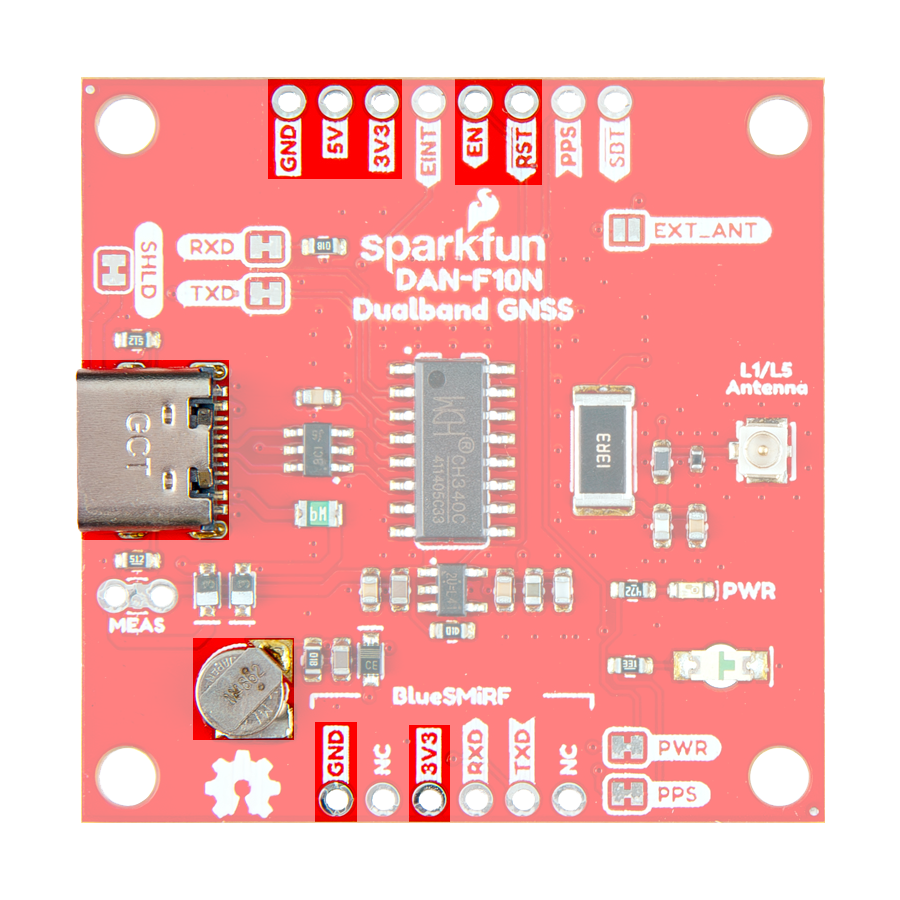{ width="400" }](./assets/img/hookup_guide/power_connections.png "Click to enlarge")
<figcaption markdown>DAN-F10N Dualband L1/L5 GNSS breakout board's power connections.</figcaption>
</figure>

Below, is a general summary of the power circuitry on the board; most are broken out as [PTH](https://en.wikipedia.org/wiki/Through-hole_technology "Plated Through Holes") pins:

- **`5V`** - The voltage from the USB-C connector, usually **5V**.
	- Input Voltage Range: 1.2 - 5.5V (1)
	- Power source for the entire board
		- Powers the 3.3V voltage regulator (RT9080), which can source up to 600mA
		- When enabled, it can also power the [BlueSMiRF header](#bluesmirf-header)
- **`3V3`** - Provides a regulated 3.3V from the [RT9080](./assets/component_documentation/RT9080.pdf), using the power supplied from the `5V` pin or USB-C connector.
	- Used to power the DAN-F10N module, power LED, and backup battery
	- Controlled by the `EN` pin, which is enabled by default
- **`EN`** - Controls the 3.3V voltage regulator [RT9080](./assets/component_documentation/RT9080.pdf), enabling the voltage output *(active `HIGH`)*
- **`RST`** - Used to reset the DAN-F10N GNSS module
	- Connected to the [`RESET_N` pin](#pio-pins) of the DAN-F10N module, an input-only pin with an internal pull-up resistor (2)
	- Driving the pin `LOW` for at least 1ms triggers a cold-start reset, clearing the `BBR` content *(receiver configuration, real-time clock (RTC), and GNSS orbit data)*
- **`GND`** - The common ground or the 0V reference for the voltage supplies.
- **Backup Battery** - Provides backup power to the DAN-F10N GNSS module to maintain ephemeris data for warm starts

1. While the [RT9080](./assets/component_documentation/RT9080.pdf) LDO regulator has an input voltage range of 1.2 - 5.5V, a minimum supply voltage of **3.5V** is recommended for a 3.3V output.

1. No capacitors should be placed between `RESET_N` to GND, otherwise it could trigger a reset on every startup.

!!! tip "JST Connector"
	The `3V3` pin of the [BlueSMiRF header](#bluesmirf-header) is designed to operate as a voltage output. However, an input voltage can be supplied through the pin, but users should be mindful of any voltage contention issues.

!!! info
	For more details, users can reference the [schematic](./assets/board_files/schematic.pdf) and the datasheets of the individual components on the board.

### Power Modes
The DAN-F10N GNSS module supports three different operation modes:

- ***Continuous Mode***

:   In this mode, the module uses dedicated signal processing engines optimized for signal acquisition and tracking.

	- The acquisition engine actively searches and acquires signals, during cold starts or when insufficient signals are available during navigation.
	- The tracking engine continuously tracks signals, downloads all the almanac data, and acquires new signals as they become available during navigation.
	
	The tracking engine consumes less power than the acquisition engine. Therefore, the module's current consumption is lower when a valid position is obtained quickly after startup, the entire almanac has been downloaded, and the ephemeris for available satellites are valid.

- *Backup Modes*

:   The DAN-F10N module supports two backup modes. The backup modes are inactive states with reduced power consumption, where the receiver maintains time, information, and navigation data to speed up signal acquisitions upon restart.

	- **Hardware backup mode**

	:   The hardware backup mode requires `V_BCKP` power to be supplied. It allows the module to enter a backup state and maintain the backup domain (`BBR` and `RTC`), after the main power has been switched off.

	- **Software standby mode**

	:   Software standby mode is entered using the `UBX-RXM-PMREQ` message. This mode will clear the RAM memory; to maintain the receiver configuration, it should be stored on `BBR` or flash layers. The software standby mode can be set for a specific duration, or until the receiver is woken up by a signal from the UART `RX` and/or `EXTINT` pins, as defined in `UBX-RXM-PMREQ` message. A system reset with the `RESET_N` signal also terminates the software standby mode, clears the `BBR` content and restarts the receiver.

### Power Consumption
The power consumption of the DAN-F10N module depends on the GNSS signals enabled and if the module is acquiring or tacking those signals. The table below, lists the average current consumption with a supply voltage of 3.3V.

<article style="text-align: center;" markdown>

| GNSS Signals | Acquisition | Tracking |
| :----------- | :---------: | :------: |
| GPS+GAL+BDS  | 26mA        | 21mA     |
| GPS+BDS      | 26mA        | 20mA     |
| GPS+GAL      | 22mA        | 19mA     |
| GPS+NavIC    | 21mA        | 18mA     |
| GPS          | 20mA        | 18mA     |
| BDS          | 24mA        | 19mA     |

</article>

!!! tip
	At startup, the inrush current can reach up to 100 mA at startup. Make sure the primary power source can sustain the required current consumption.

!!! info "Backup Modes"
	The current consumption for the backup modes:

	- Hardware backup Mode: 31µA
	- Software standby Mode: 49µA

!!! info
	For more information, please refer to the [DAN-F10N Datasheet](./assets/component_documentation/DAN-F10N_DataSheet_UBXDOC-963802114-13074.pdf).

## DAN-F10N GNSS Receiver
The centerpiece of the DAN-F10N Dualband L1/L5 GNSS breakout board, is the [DAN-F10N module](./assets/component_documentation/DAN-F10N_DataSheet_UBXDOC-963802114-13074.pdf) from [u-blox](https://www.u-blox.com/en). Their proprietary dual-band multipath mitigation technology enables the u-blox F10 GNSS engine to isolate the best signals from the L1 and L5 bands; delivering a solid meter-level position accuracy in challenging urban environments. Additionally, the DAN-F10N module's robust SAW-LNA-SAW RF architecture with an additional notch filter on the L1 RF path ensures the best possible out-of-band interference mitigation from nearby cellular modems.

The DAN-F10N GNSS module comes with a 20 x 20 x 8 mm, integrated, Right Hand Circular Polarized (RHCP), L1/L5 dual-band patch antenna that offers the best compromise between size and performance. The patch antenna's wide beamwidth provides flexibility in the device's orientation; while alternatively, the module also has an antenna switch function to give users the option to utilize an external dual-band antenna, further increasing its utility.

<article class="video-500px" style="text-align: center; margin: auto;" markdown>
<iframe src="https://www.youtube.com/embed/7_Pxe2rVFIQ" title="u-blox F10 GNSS platform for meter-level accuracy in urban environments" frameborder="0" allow="accelerometer; autoplay; clipboard-write; encrypted-media; gyroscope; picture-in-picture" allowfullscreen></iframe>
{ .qr width="85" }
</article>

-   <figure markdown>
	[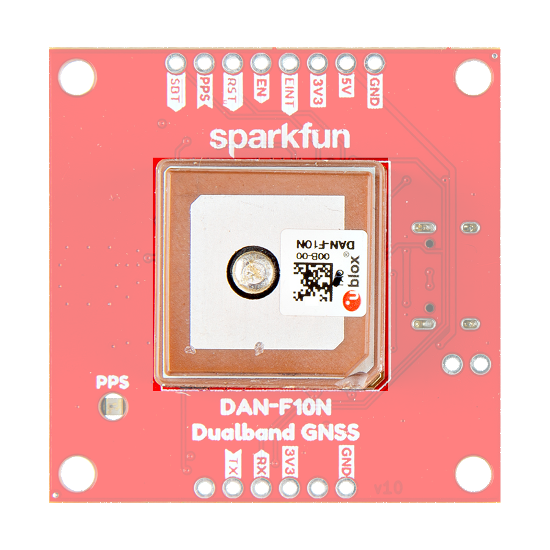{ width="400" }](./assets/img/hookup_guide/DAN-F10N.png "Click to enlarge")
	<figcaption markdown>The DAN-F10N module on the breakout board.</figcaption>
	</figure>

**Features:**

- Operating Voltage: **2.7 - 3.6V**
- Operating Temperature: -40 - 85&deg;C
- GNSS Support
	- GPS: L1 C/A, L5
	- QZSS: L1C/A, L1S, L1Sb, L5
	- GAL: E1B/C, E5a
	- BDS: B1C, B2a
	- NavIC: L5
	- SBAS: L1C/A
	- BDSBAS: B1C
- Sensitivity
	- Tracking & Nav: –164dBm
	- Reacquisition: –156dBm
	- Cold start: –145dBm
	- Hot start: –156dBm

 

- Update Rate: Up to 10Hz
- Time to Fix
	- Cold Start: < 28s
	- Aided Start: < 2s
	- Hot Start: 2s
- Position Accuracy
	- 1.0 m (with SBAS)
	- 1.5 m (without SBAS)
- Interfaces
	- 1x Serial interface
		- Raw data output: Code phase data
		- Protocols: NMEA 4.11, UBX binary
	- 2x Digital I/O
		- Timepulse Configurable: 0.25 - 10MHz
		- `EXTINT` input for Wakeup

### Frequency Bands
The DAN-F10N GNSS module is a dual-band, multi-constellation GNSS receiver. Below, are the frequency bands provided by all the global navigation satellite systems and the ones supported by the DAN-F10N module.

<article style="text-align: center;" markdown>

| Constellation | Frequency Bands      |
| :-----------: | :------------------- |
| GPS           | L1 C/A, L5           |
| QZSS          | L1C/A, L1S, L1Sb, L5 |
| GAL           | E1B/C, E5a           |
| BDS           | B1C, B2a             |
| NavIC         | L5                   |
| SBAS          | L1C/A                |
| BDSBAS        | B1C                  |

*The frequency bands supported by the DAN-F10N GNSS receiver.*
</article>

<figure markdown>
[{ width="800" style="background-color: rgba(255, 255, 255, 0.85); padding: 5px;" }](https://www.tallysman.com/app/uploads/2021/07/Tallysman-GNSS-Frequencies-v8.0_Chart-1-1024x425.png "Click to enlarge")
<figcaption markdown>Frequency bands of the global navigation satellite systems. (Source: [Tallysman](https://www.tallysman.com/gnss-constellations-radio-frequencies-and-signals/))</figcaption>
</figure>

??? info "What are Frequency Bands?"
	A [frequency band](https://en.wikipedia.org/wiki/Frequency_band) is a section of the [electromagnetic spectrum](https://en.wikipedia.org/wiki/Electromagnetic_spectrum), usually denoted by the range of its upper and lower limits. In the [radio spectrum](https://en.wikipedia.org/wiki/Radio_spectrum), these frequency bands are usually regulated by region, often through a government entity. This regulation prevents the interference of RF communication; and often includes major penalties for any interference with critical infrastructure systems and emergency services.

	<figure markdown>
	[{ width="400" }](https://gssc.esa.int/navipedia/images/c/cf/GNSS_All_Signals.png "Click to enlarge")
	<figcaption markdown>Frequency bands of the global navigation satellite systems. (Source: [ESA](https://gssc.esa.int/navipedia/index.php?title=File:GNSS_All_Signals.png "European Space Agency"))</figcaption>
	</figure>

	However, if the various GNSS constellations share similar frequency bands, then how do they avoid interfering with one another? Without going too far into detail, the image above illustrates the frequency bands of each system with a few characteristics specific to their signals. Wit these characteristics in mind, along with other factors, the chart can help users to visualize how multiple GNSS constellations might co-exist with each other.

	For more information, users may find these articles of interest:

	- [GNSS signal](https://gssc.esa.int/navipedia/index.php/GNSS_signal)
	- [GPS Signal Plan](https://gssc.esa.int/navipedia/index.php?title=GPS_Signal_Plan)
	- [GLONASS Signal Plan](https://gssc.esa.int/navipedia/index.php?title=GLONASS_Signal_Plan)
	- [GALILEO Signal Plan](https://gssc.esa.int/navipedia/index.php?title=GALILEO_Signal_Plan)

## Peripherals and I/O Pins
The DAN-F10N module has twelve I/O pins, of which five are programmable. Most of these are broken out as [PTH](https://en.wikipedia.org/wiki/Through-hole_technology "Plated Through Holes") pins on the DAN-F10N Dualband L1/L5 GNSS breakout board; whereas, others are broken out to their specific interface *(i.e. USB connector, jumper, U.FL connector, etc.)*. Additionally, some of the I/O connections are broken out with multiple components or interfaces.

<figure markdown>
[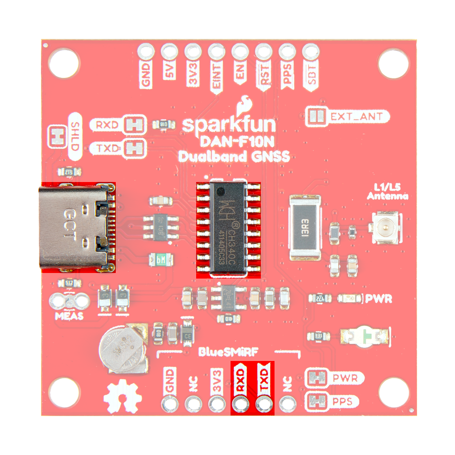{ width="400" }](./assets/img/hookup_guide/peripherals.png "Click to enlarge")
<figcaption markdown>The UART interfaces on the DAN-F10N GNSS breakout board.</figcaption>
</figure>

<figure markdown>
[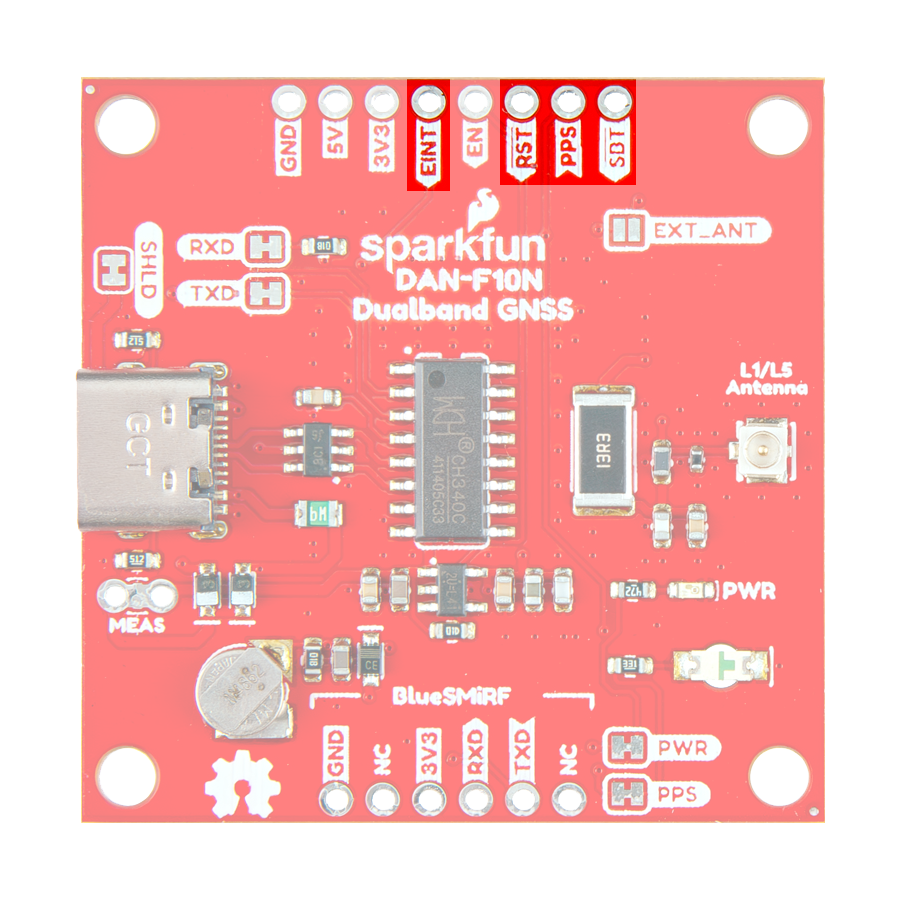{ width="400" }](./assets/img/hookup_guide/pins.png "Click to enlarge")
<figcaption markdown>The I/O pins on the DAN-F10N GNSS breakout board.</figcaption>
</figure>

<article class="annotate" markdown>
**Interfaces:**

- 1x UART
- ~~1x LNA enable pin~~ (1)
- 1x External interrupt
- 1x PPS output signal
- 1x Safe boot pin
- 1x Reset pin

</article>

1. Not available on the DAN-F10N Dualband L1/L5 GNSS breakout board.

=== "UART Interface"

	

	

	<figure markdown>
	[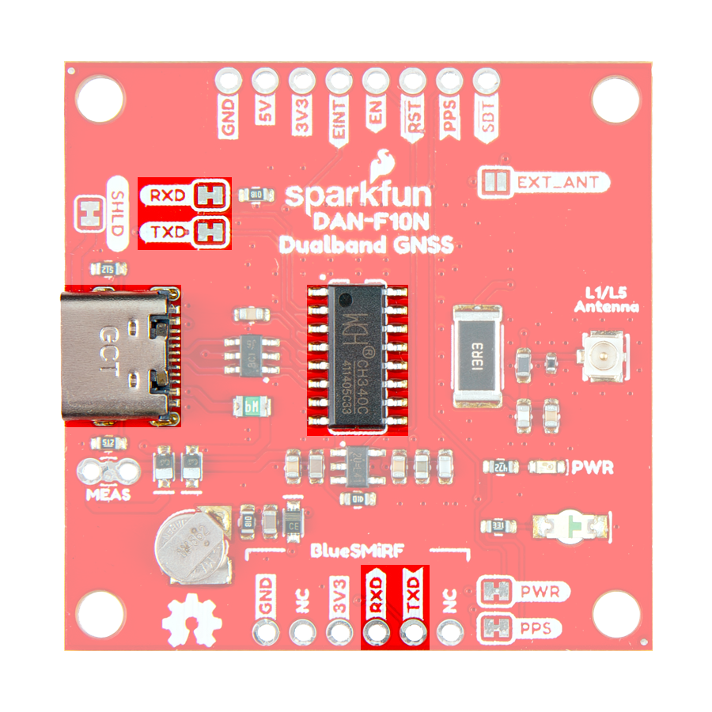{ width="400" }](./assets/img/hookup_guide/pins-uarts.png "Click to enlarge")
	<figcaption markdown>The `COM` pins on the DAN-F10N GNSS breakout board.</figcaption>
	</figure>

	

	

	The DAN-F10N has a single UART interface that can be accessed either through the [PTH](https://en.wikipedia.org/wiki/Through-hole_technology "Plated Through Holes") pins or the USB-C connector, with the help of the CH340 USB-to-serial converter. The operation of these connections is configured with the [`RX` and `TX` jumpers](#jumpers).

	!!! info "Supported Protocols"
		The UART interface supports the following protocols:

		- Input messages: NMEA and UBX
		- Output messages: NMEA (GGA, GLL, GSA, GSV, RMC, VTG, and TXT)

	!!! info "Configuration Settings"
		The UART interface can be configured with the `CFG-UART1-*` messages, but will initially have the following settings: 

		- Baudrate: 9600 to 921600bps *(Default: 38400bps)*
		- Data Bits: 8
		- Parity: No
		- Stop Bits: 1
		- Flow Control: None

	

	

=== "PIO Pins"

	

	

	<figure markdown>
	[{ width="400" }](./assets/img/hookup_guide/pins-pio.png "Click to enlarge")
	<figcaption markdown>The `GPx` pins on the DAN-F10N GNSS breakout board.</figcaption>
	</figure>

	

	

	The DAN-F10N module features five programmable I/O pins, but the LNA enable pin is not broken out on this board. All the inputs have internal pull-up resistors in normal operation and can be left open if unused.

	- **`EXTINT`**
	:   DAN-F10N supports external interrupts through its `EXTINT` pin. This is useful for waking the module up from its standby mode or for timing applications.

	- **`SBT`** *(Reserved for future use)*
	:   The `SAFEBOOT_N` pin is for updates and reconfiguration. The DAN-F10N module will enter safeboot mode, if this pin is pulled `LOW` at starup.

	- **`PPS`**
	:   The [`PPS` pin](#pps-output) is connected to the `TIMEPULSE` pin of the DAN-F10N and the [`PPS` LED](#status-leds). The period, length, and polarity (rising or falling edge) of the `TIMEPULSE` signal can be configured with the `CFG-TP-*` messages.

			!!! info
				The `SBT` (`SAFEBOOT_N`) and `PPS` (`TIMEPULSE`) pins are internally connected in the DAN-F10N module, by a 1 k&ohm; series resistor. Make sure these pins have no load that could pull them low at startup; otherwise, the receiver will enter its safeboot mode.

	- **`RST`**
	:	The `RST`pin is connected to the `RESET_N` pin of the DAN-F10N module. Driving the pin `LOW` for at least 1ms triggers a cold-start reset, clearing the `BBR` content *(receiver configuration, real-time clock (RTC), and GNSS orbit data)*.

			!!! info
				Capacitors should not be placed between `RST` and `GND`; otherwise, it could trigger a reset on startup.

	

	

=== "PPS Output"

	

	

	<figure markdown>
	[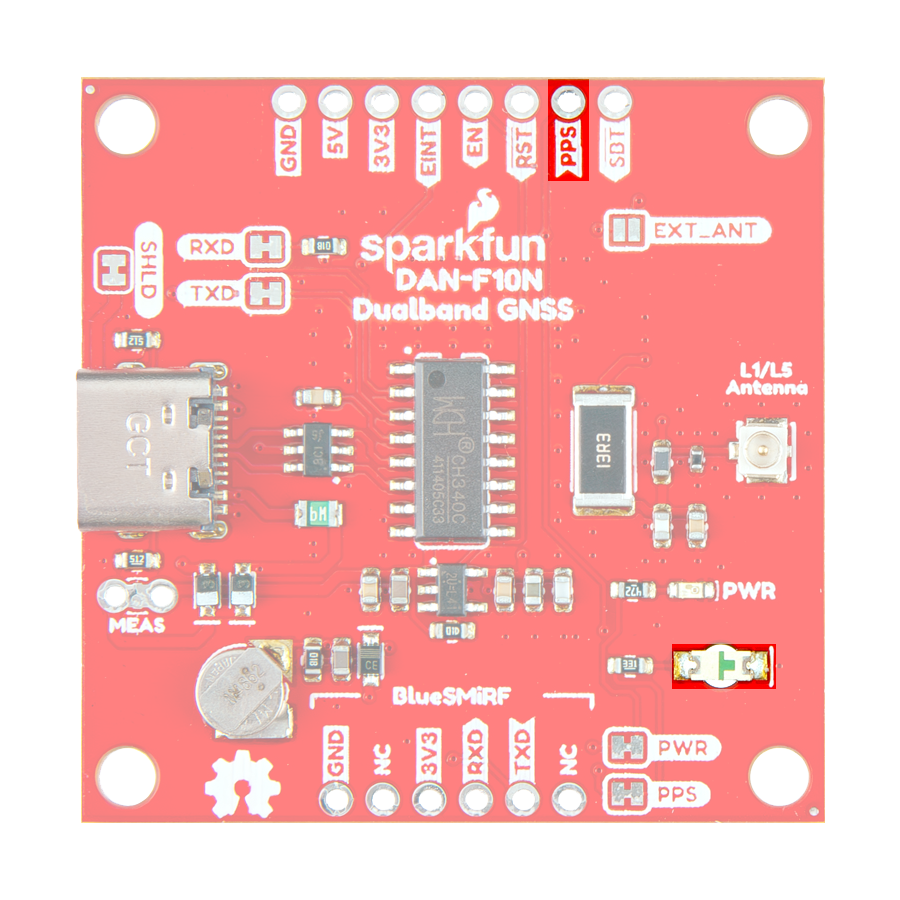{ width="400" }](./assets/img/hookup_guide/pins-pps.png "Click to enlarge")
	<figcaption markdown>The `PPS` output signal on the DAN-F10N GNSS breakout board.</figcaption>
	</figure>

	

	

	The [`PPS`](https://en.wikipedia.org/wiki/Pulse-per-second_signal "Pulse Per Second") pin is connected to the module's time pulse (`TIMEPULSE`) signal and the [`PPS` LED](#status-leds), as a visual indicator. The period, length, and polarity (rising or falling edge) of the `TIMEPULSE` signal can be configured with the `CFG-TP-*` messages.

	!!! tip "Disable LED"
		There is a [jumper](#jumpers) attached to the `PPS` LED. For low power applications, users can cut the jumper to disable the `PPS` LED.

	!!! info
		The module's `SAFEBOOT_N` (`SBT`) pin is internally connected to its `TIMEPULSE` (`PPS`) pin through a 1 k&ohm; series resistor. Make sure these pins have no load that could pull them low at startup; otherwise, the receiver will enter its safeboot mode.

	

	

### USB-C Connector
A USB connector is provided to power the board and interface with the DAN-F10N GNSS receiver through a CH340 USB-to-serial converter. For most users, it will be the primary method for communicating with the DAN-F10N module.

<figure markdown>
[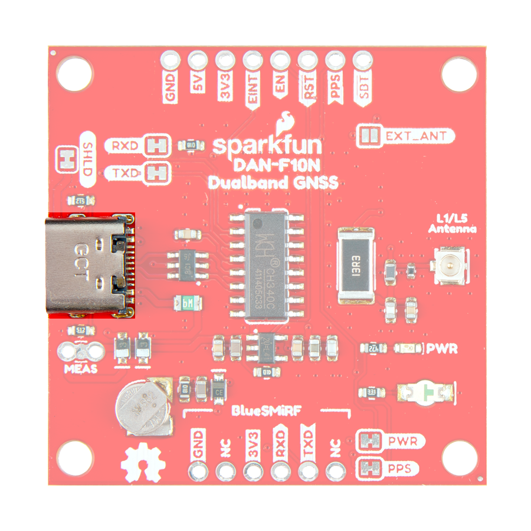{ width="400" }](./assets/img/hookup_guide/usb_connector.png "Click to enlarge")
<figcaption markdown>USB-C connector on the DAN-F10N GNSS breakout board.</figcaption>
</figure>

!!! info
	Users will need to [install the USB driver](software_overview.md#usb-driver) for the CH340 USB-to-serial converter, before they can interact with the DAN-F10N GNNS module.

### U.FL Connector
The `L1/L5 Antenna` U.FL connector provides an optional, input for a external GNSS antenna. Users will need to modify the [`EXT_ANT` jumper](#jumpers), to trigger the RF switch to change from the integrated patch antenna to the external antenna connection.

<figure markdown>
[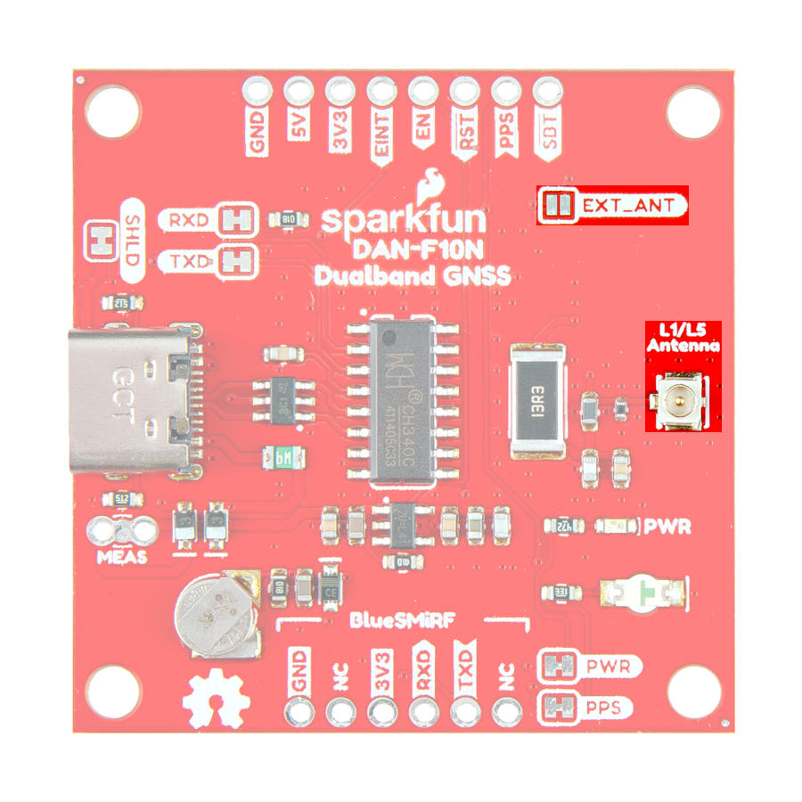{ width="400" }](./assets/img/hookup_guide/antenna.png "Click to enlarge")
<figcaption markdown>The U.FL connector to attach an external GNSS antenna to the DAN-F10N GNSS breakout board.</figcaption>
</figure>

!!! tip
	For the best performance, we recommend users choose a compatible L1/L5 GNSS antenna and utilize a low-loss cable. Also, don't forget that GNSS signals are fairly weak and can't penetrate buildings or dense vegetation. The GNSS antenna should have an unobstructed view of the sky.

### BlueSMiRF Header
The DAN-F10N has a single [UART interface](#uart-interface) that can be accessed either through the BlueSMiRF header pins or the USB-C connector. The BlueSMiRF header can be used to connect the DAN-F10N GNSS module to external devices, such as a microcontroller or [BlueSMiRF v2](https://www.sparkfun.com/sparkfun-bluesmirf-v2.html), Bluetooth^&reg;^ serial link.

<figure markdown>
[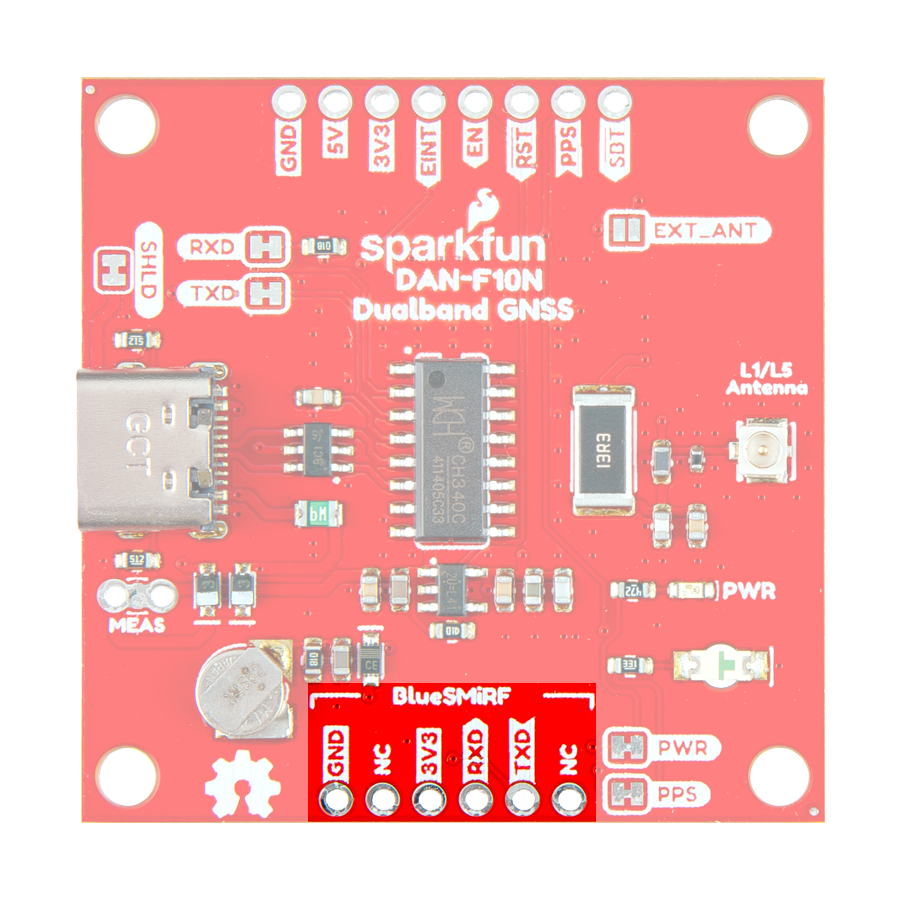{ width="400" }](./assets/img/hookup_guide/headers-bluesmirf.png "Click to enlarge")
<figcaption markdown>The BlueSMiRF header pins on the DAN-F10N GNSS breakout board.</figcaption>
</figure>

!!! info "Supported Protocols"
	The UART interface supports the following protocols:

	- Input messages: NMEA and UBX
	- Output messages: NMEA (GGA, GLL, GSA, GSV, RMC, VTG, and TXT)

!!! info "Configuration Settings"
	The UART interface can be configured with the `CFG-UART1-*` messages, but will initially have the following settings: 

	- Baudrate: 9600 to 921600bps *(Default: 38400bps)*
	- Data Bits: 8
	- Parity: No
	- Stop Bits: 1
	- Flow Control: None

!!! warning "Bus Contention"
	To avoid [bus contention](https://en.wikipedia.org/wiki/Bus_contention) issues between the USB-C connection and the external device, users may want to use the [`RXD` and `TXD` jumpers](#jumpers) to disconnect the CH340 USB-to-serial converter from the UART interface of the DAN-F10N GNSS module.

!!! tip "Pin Connections"
	When connecting the DAN-F10N Dualband L1/L5 GNSS breakout board to another device, users need to be aware of the pin connections and voltage ranges of the products. Below, is a table of the pin connections for the BlueSMiRF header pins on the DAN-F10N GNSS breakout board.

	<article style="text-align: center;" markdown>

	<table border="1" markdown>
	<tr markdown>
	<th style="vertical-align:middle;">Pin Number</th>
	<td align="center" markdown>
		**1** 
		*(Left Side)*
	</td>
	<td align="center" markdown>**2**</td>
	<td align="center" markdown>**3**</td>
	<td align="center" markdown>**4**</td>
	<td align="center" markdown>**5**</td>
	<td align="center" markdown>
		**6** 
		*(Right)*
	</td>
	</tr>
	<tr markdown>
	<th style="vertical-align:middle;">Label</th>
	<td align="center" markdown>`NC`</td>
	<td align="center" markdown>`TXD`</td>
	<td align="center" markdown>`RXD`</td>
	<td align="center" markdown>`3V3`</td>
	<td align="center" markdown>`NC`</td>
	<td align="center" markdown>`GND`</td>
	</tr>
	<tr markdown>
	<th style="vertical-align:middle;">Function</th>
	<td align="center" markdown></td>
	<td align="center" markdown>UART - Transmit</td>
	<td align="center" markdown>UART - Receive</td>
	<td align="center" markdown>Output Voltage: **3.3V**</td>
	<td align="center" markdown></td>
	<td align="center" markdown>Ground</td>
	</tr>
	</table>

	</article>

## Status LEDs

<figure markdown>
[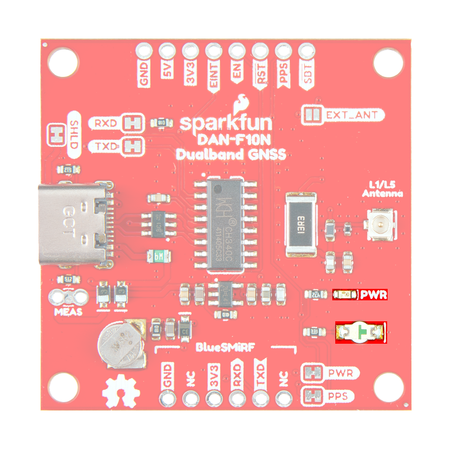{ width="400" }](./assets/img/hookup_guide/LEDs.png "Click to enlarge")
<figcaption markdown>The status indicator LEDs on the DAN-F10N Dualband L1/L5 GNSS breakout board.</figcaption>
</figure>

There are two status LEDs on the DAN-F10N Dualband L1/L5 GNSS breakout board:

- `PWR` - Power *(Red)*
	- Turns on once 3.3V power is supplied to the board
- `PPS` - Pulse-Per-Second *(Green)*
	- Indicates when there is a time pulse signal *(see the **[PPS Output](#pps-output)** section)*

!!! info
	For low power applications, the LEDs can be disabled to conserve energy. *See the [**Jumpers** section](#jumpers).*

## Jumpers

??? note "Never modified a jumper before?"
	Check out our <a href="https://learn.sparkfun.com/tutorials/664">Jumper Pads and PCB Traces tutorial</a> for a quick introduction!

	

	-   <a href="https://learn.sparkfun.com/tutorials/664">
		<figure markdown>
		
		</figure>

		---

		**How to Work with Jumper Pads and PCB Traces**</a>

	

There are seven jumpers on the back of the board that can be used to easily modify the hardware connections on the board.

<figure markdown>
[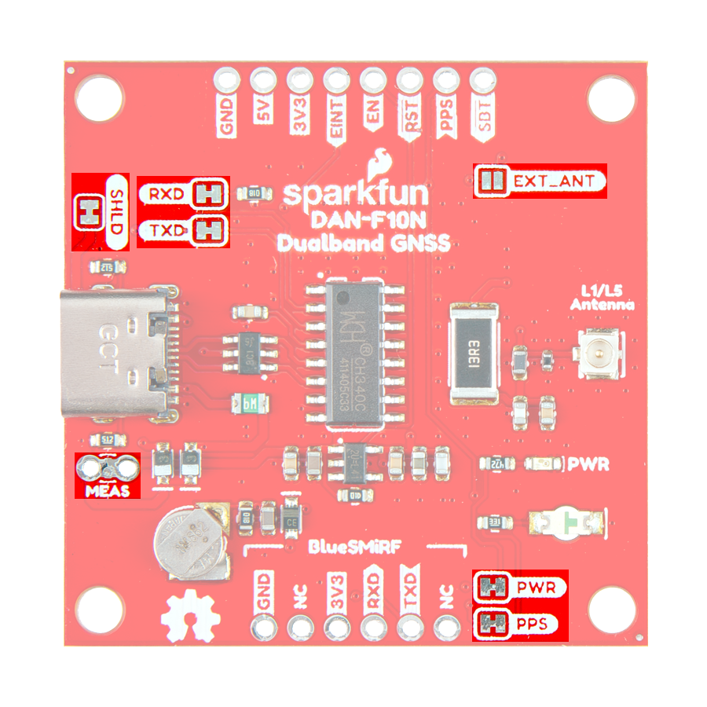{ width="400" }](./assets/img/hookup_guide/jumpers.png "Click to enlarge")
<figcaption markdown>The jumpers on the bottom of the DAN-F10N Dualband L1/L5 GNSS breakout board.</figcaption>
</figure>

LED Jumpers
:   Two of the jumpers control power to the status LEDs on the board.

	!!! info
		By default, all the jumpers are connected, to power the status LEDs. For low power applications, users can cut the jumpers to disconnect power from each of the LEDs.

	- **`PWR`** - This jumper can be cut to remove power from the red, power LED.
	- **`PPS`** - This jumper can be cut to remove power from the green, `PPS` LED that is provided by the [`PPS` signal](#pps-output).

UART Jumpers
:   Two of the jumpers control the `RX` and `TX` signals on the board.

	!!! tip
		A 1k&ohm; resistor is placed on the 

	- **`RXD`** - This jumper can be cut to disconnect the `RX` signal of the DAN-F10N module from the CH340 USB-to-serial converter.
	- **`TXD`** - This jumper can be cut to disconnect the `TX` signal of the DAN-F10N module from the CH340 USB-to-serial converter.

**`EXT_ANT`**
:   This jumper can be modified to control the source of the GNSS signals between the DAN-F10N module's integrated L1/L5 dual-band patch antenna or an external antenna connected to the board's U.FL connector.

	!!! info
		By default, the module's integrated L1/L5 dual-band patch antenna is utilized.

**`MEAS`**
:   This jumper can be cut for current measurments to the RT9080 voltage regulator from the USB-C connector or `5V` pin.

**`SHLD`**
:   This jumper can be cut to disconnect the shield of the USB-C connector from the board's ground plane.
