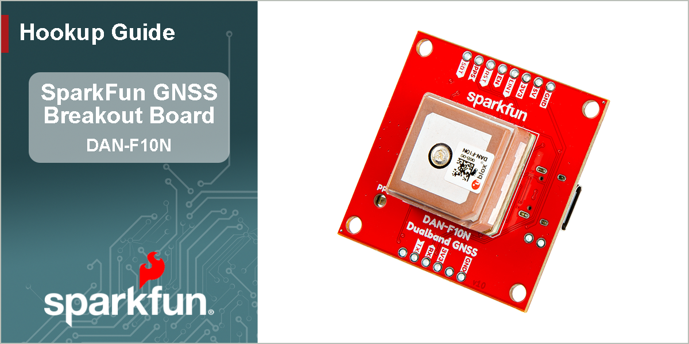

<figure markdown>

</figure>

---

# Introduction

-   <a href="https://www.sparkfun.com/sparkfun-dualband-l1-l5-gnss-breakout-dan-f10n.html">
	**Dualband L1/L5 GNSS Breakout - DAN-F10N** 
	**SKU:** GPS-28435

	---

	<figure markdown>
	
	</figure></a>

	<article style="text-align: center;" markdown>
	{ .tinyqr }[Purchase from SparkFun :fontawesome-solid-cart-plus:{ .heart }](https://www.sparkfun.com/sparkfun-dualband-l1-l5-gnss-breakout-dan-f10n.html){ .md-button .md-button--primary }
	</article>

-   The SparkFun Dualband L1/L5 GNSS Breakout - DAN-F10N features u-blox's dual-band GNSS technology for the L1/L5 frequency bands. Their proprietary dual-band multipath mitigation technology enables the u-blox F10 GNSS engine to isolate the best signals from the L1 and L5 bands; delivering a solid meter-level position accuracy in challenging urban environments. Additionally, the DAN-F10N module's robust SAW-LNA-SAW RF architecture with an additional notch filter (LTE B13) on the L1 RF path ensures the best possible out-of-band interference mitigation from nearby cellular modems.

	The DAN-F10N GNSS module on this board comes with a 20 x 20 x 8 mm, integrated, Right Hand Circular Polarized (RHCP), L1/L5 dual-band patch antenna that offers the best compromise between size and performance. The patch antenna's wide beamwidth provides flexibility in the device's orientation; while alternatively, the module also has an antenna switch function to give users the option to utilize an external dual-band antenna, further increasing its utility.

	The DAN-F10N module is supported by the u-blox u-center 2 GNSS software for real-time performance analysis, receiver configuration, and data logging. The AssistNow Online, Offline, and Autonomous A-GNSS services can also be used with the module for faster satellite acquisition. Users can also interface with the GNSS module using NMEA 4.11 and UBX binary protocols.

	!!! note "GPS `L5` Signals"
		The GPS `L5` signals are currently, considered as *"pre-operational"* and not utilized by default in navigation solutions. However, it is possible override the receiver's configuration to evaluate the GPS `L5` signals. Please refer to the integration manual for more details.

		This is an operational limitation of the satellite/space segment and not an issue of the u-blox product.

In this guide we'll cover how to setup the DAN-F10N GNSS breakout board. To follow along with this tutorial, at a minimum, users will need the following items:

- Computer with an operating system (OS) that is compatible with all the software installation requirements
- [USB 3.1 Cable A to C - 3 Foot](https://www.sparkfun.com/usb-3-1-cable-a-to-c-3-foot.html) - Used to interface with the DAN-F10N GNSS Breakout (1)
- [SparkFun Dualband L1/L5 GNSS Breakout - DAN-F10N](https://www.sparkfun.com/sparkfun-dualband-l1-l5-gnss-breakout-dan-f10n.html)

1. If your computer doesn't have a USB-A slot, then choose an appropriate cable or adapter.

-   <a href="https://www.sparkfun.com/usb-3-1-cable-a-to-c-3-foot.html">
	<figure markdown>
	
	</figure>

	---

	**USB 3.1 Cable A to C - 3 Foot** 
	CAB-14743</a>

-   <a href="https://www.sparkfun.com/sparkfun-dualband-l1-l5-gnss-breakout-dan-f10n.html">
	<figure markdown>
	
	</figure>

	---

	**Dualband L1/L5 GNSS Breakout - DAN-F10N** 
	GPS-28435</a>

## Section Topics
This guide is divided into three sections:

- The **Quickstart Guide** assumes a working knowledge of GNSS receiver, development boards, and the required software to program and/or configure them for your project's needs. It only covers basic hardware information and assembly instructions users would need to get started with this product.
- The **Hardware** section has two sub-sections that provide:
	- An overview of the board's design, major components, and interfaces. Refer to this page for information on the connectors, breakout pins, and jumpers.
	- Assembly instructions for this product's interfaces.
- The **Software** section has several sub-sections. The DAN-F10N module has numerous capabilities and a multitude of ways to configure and interface with them.
- In the **Resources** and **Support** sections, users can find the design files (KiCad files & schematic), relevant documentation (datasheets, white papers, etc.) and other helpful links on the Resources page. Lastly, the **Troubleshooting Tips** page includes helpful tips and instructions for how to receive technical support from SparkFun.
